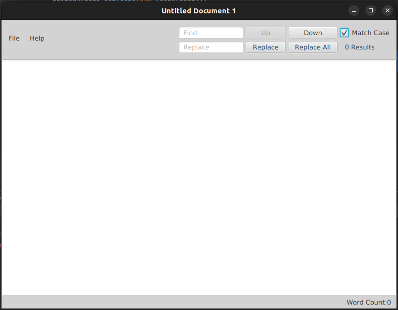

# Simple-Text-Editor

This is a simple text editor application built with Java and JavaFX. It provides basic functionalities like saving files, saving files with a different name, finding and replacing text with case matching, and displaying word count.



## Features

- Save: Save the current file.
- Save As: Save the current file with a different name or location.
- Find and Replace: Find and replace text in the document with case matching.
- Word Count: Display the number of words in the document.

## Prerequisites

To run the application, you need to have the following installed:

- Java Development Kit (JDK)
- JavaFX SDK
- Scene Builder (optional)

## Getting Started

Clone the repository:

```shell
git clone https://github.com/RH-JavaFX-Projects/Simple-Text-Editor.git
